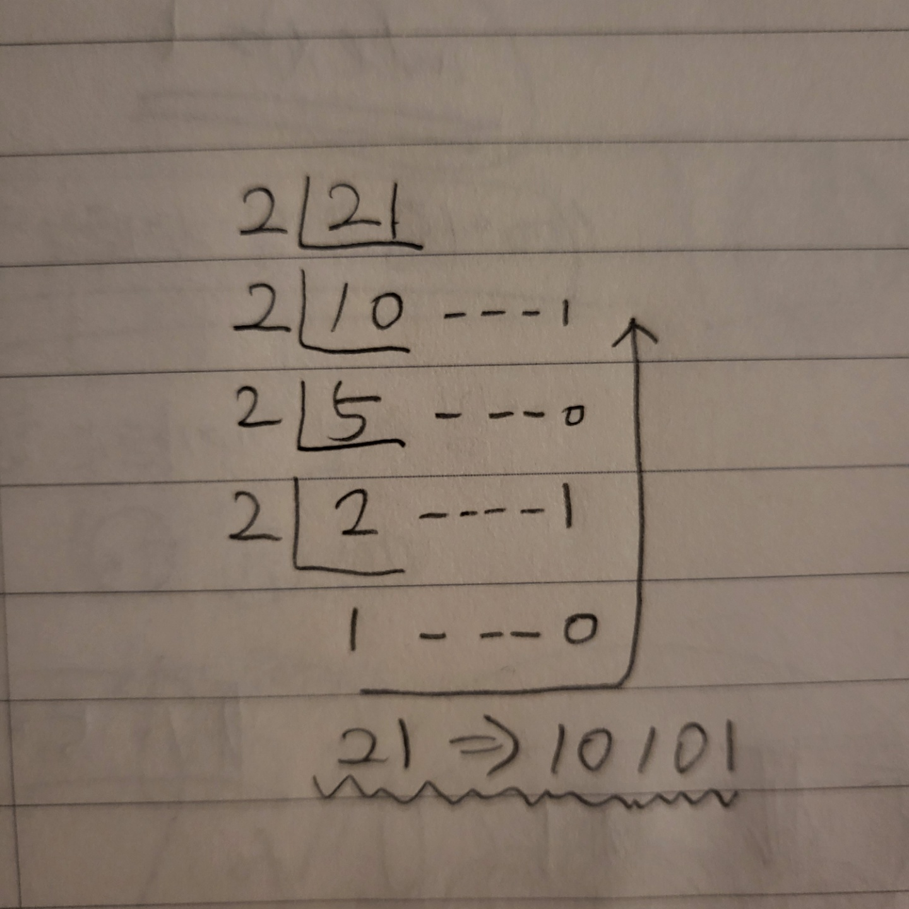
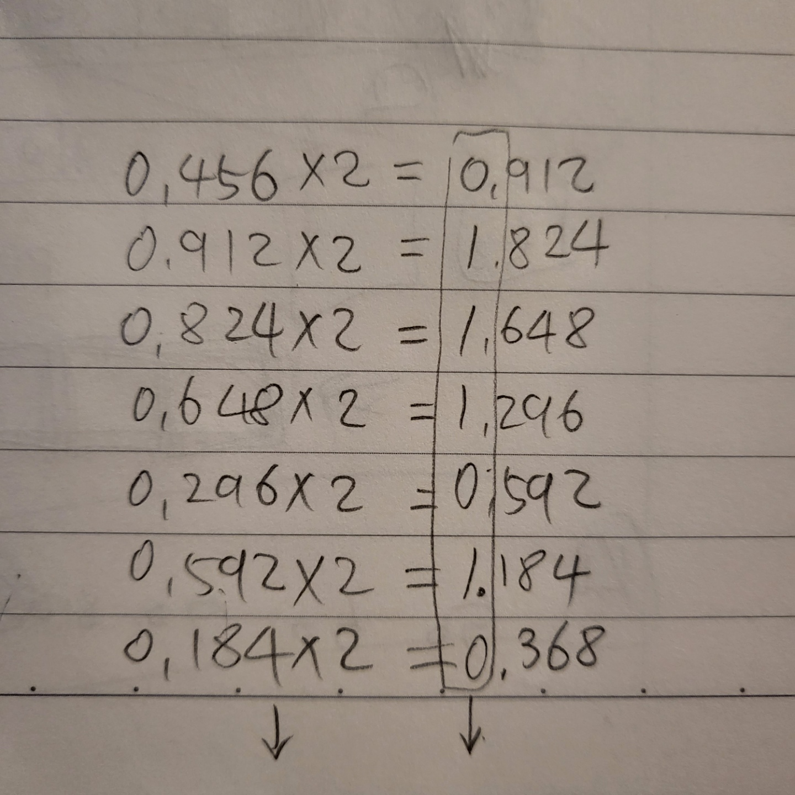

# 1. 소수를 이진법으로 표현하기

## 1. 정수를 이진법으로 표현하는 방법

> 정수를 2로 '더이상 나누어지지 않을 때까지' 나누고 나머지를 나열한다.

ex) 21을 이진법으로 => 10101

## 2. 소수를 이진법으로 표현한 방법

> 소수에 2를 '결과가 1로 떨어지거나 똑같은 소수점이 나올때까지' 곱하고 몫을 나열한다.

ex) 0.456을 이진법으로 => 0.`0111010`01011110001101010011111101111100111011011001001

