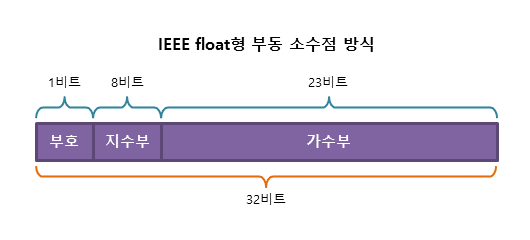

# 1. 컴퓨터가 숫자를 표현하는 방법

## 1. 정수 표현

> (간단!) 10진법 => 2진법

## 2. 실수 표현

> 실수도 컴퓨터는 2진법으로 표현을 해야된다.

> 정수 부분은 2진법으로 표현한다 치지만... 실수부분은 어떻게 표현할까?

### 1. 고정 소수점 (fixed point) 방식

- `정수부`와 `소수부`로 나뉜다.
- 소수부의 자릿값(비트)를 미리 정해 놓는 것
- 그렇기 때문에 표현할 수 있는 범위가 비교적 적다.


```
ex)
// 21.25 를 고정 소수점 방식으로 표현한다면?
// 1. 부호(1비트): 양수이기 떄문에 0
// 2. 정수부(15비트): 10101 => 15비트 중 5비트 사용, 나머지 10비트는 낭비
// 2. 소수부(16비트): (소수) 01 => 16비트 중 2비트 사용, 나머지 14 비트는 낭비
```


---

### 2. 부동 소수점 (floating point) 방식

~~부동이라고 해서 움직이지 않는게 아니라 반대로 움직이는 소수점..~~

- `지수부`와`가수부`로 나뉜다.
- ±(가수부) \* 2^(지수부 - 127) 범위의 비교적 큰 수까지 표현할 수 있음



```
// 21.25 를 부동 소수점 방식으로 표현한다면?
// 1. 부호(1비트) 양수 이기 때문에 0
// 2. 21.25 이진법으로 표현하면 => 10101.01
// 3. 10101.01을 첫째자리만 남기고 모두 소수점 아래로 보내준다. => 1.010101 * 2^4
// 4. 가수부 (23비트) => 010101 => 23비트중 6비트 사용
// 5. 지수부 (8비트) => bias(127) + n(4) => 131
// 6. 131을 이진법으로 변환 => 10000011 8비트 중 8비트 사용
```

> ## bias에 왜 n을 더하는걸까?.. bias는 또 뭐고..

> 현재 사용하고 있는 부동소수점 방식은 대부분 IEEE 754 표준을 따르고 있다.
>
> 자바스크립트도 물론!
>
> IEEE 754 표준애서 정의 하고 있는 부동 소수점은 32비트형이 있고, 64비트 형이 있다.

> 32비트형을 예로 들어보자
>
> 32비트형에서는 지수부에 8비트가 할당이 되었다.
>
> 이 말은 32비트형에서는 지수를 표현 할 수 있는 숫자가 2^8 개, 즉 256개 이다.
>
> 정확히 말하면 지수부에 저장할 수 있는 숫자는 0 ~ 255 (256개)이다.
>
> 그런데 지수는 음수도 표현할 수 있어야한다.
>
> 256개 에서 0을 제외하면 255개이고, 255개에서 음수와 양수를 나눠야 되는데 홀수개라서 동등하게 나눌 수가 없네..?
>
> 그럼 뭔가 기준이 있어야 할 것 같은데...
>
> > bias (편향) => 편가르기, 기준을 말한다.
>
> bias 127이란, 127을 지수 0으로 보고 그 아래를 음의 지수, 위를 양의 지수로 표현!
>
> 그래서 bias 127에서는
>
> -127 ~ 0 ~ 128 (실제 지수)
>
> 0 ~ 127 ~ 255 (bias 127)
>
> > 위에서 지수n 이 4가 나왔는데 이를 표현하기 위해서는 127(실제 지수는 0을 의미)에 n을 더하면 131을 메모리에 저장해야한다. 그래서 131을 이진법으로 변환하여 저장한다.
>
> 나중에 숫자를 불러올때는 반대의 과정을 거치겠지..
>
> 131 - 127을 빼고 ... 뺀 결과를 지수로....,,,
